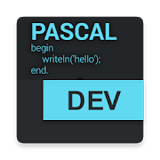
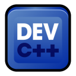

<h1> Hola!  </h1>

 Soy Fernando Etchegaray. Actualmente estoy finalizando la diplomatura de  en la Universidad Tecnologica Nacional

Podes ver algo mas de mi experiencia laboral, formacion y como contactarme a continuacion! :smile: 

<h2> Sobre mi </h2>

- Actualmente estoy terminando la diplomatura en Python 3

- Tengo experiencia programando en otras tecnologias (algunas no tan actuales o potentes...) como: Turbo Pascal, Borland C, DEV C++, Arduino y plataformas RISC

- Tengo un nivel avanzado de ingles oral y escrito (PET & FCE)

- Soy una persona que se desenvuelve bien en ambientes dinamicos y tengo facilidad para trabajar en equipo

<h2> Mis habilidades?  </h2>

-  
- 
- 
- 
- 

<h2> Como me podes contactar:  </h2>
 
 
 
